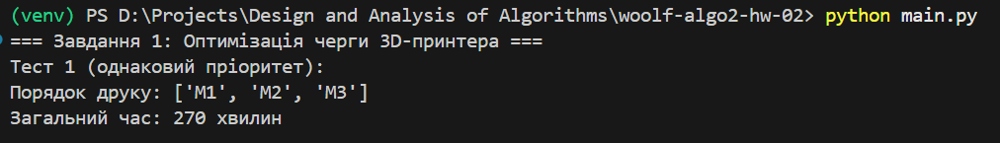
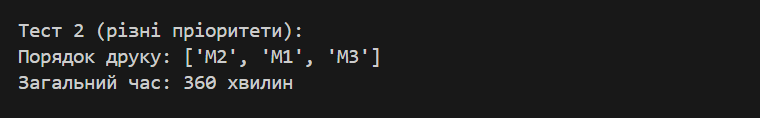
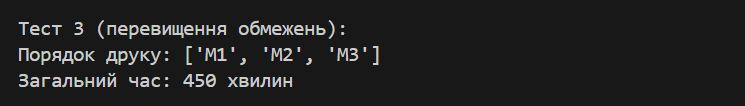
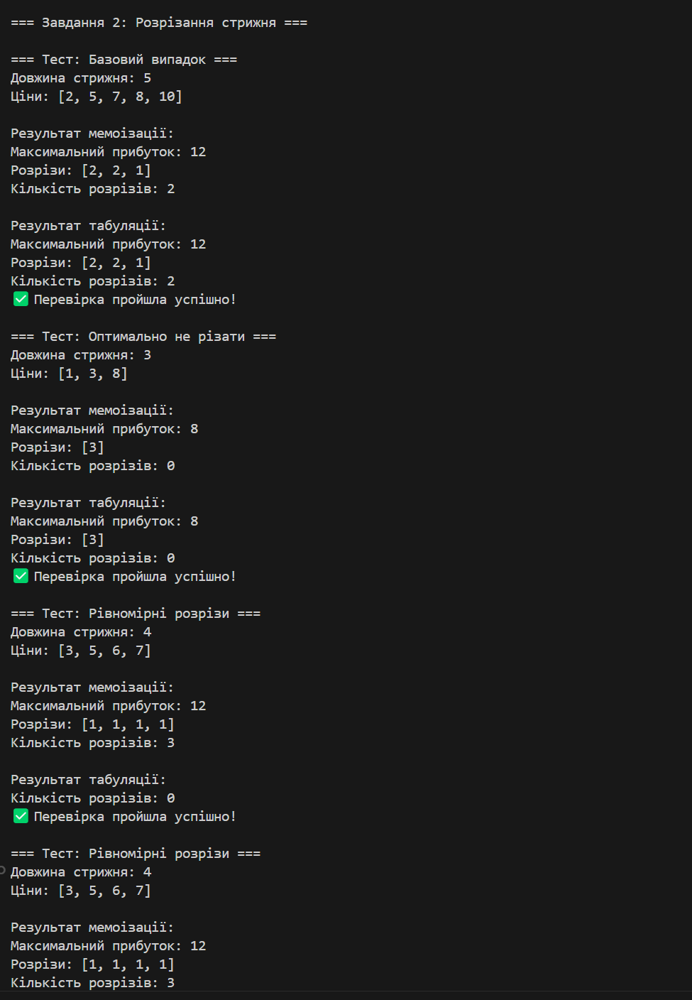

# woolf-algo2-hw-02

# 🧠 Домашнє завдання №2: Жадібні алгоритми та динамічне програмування

Цей репозиторій містить розв’язання двох задач:

1. **Оптимізація черги 3D-принтера** (жадібний алгоритм)
2. **Задача розрізання стрижня** (динамічне програмування — мемоізація та табуляція)

---

## Структура проекту

```
goit-algo2-hw-02/
├── main.py
├── README.md
├── screenshots/
│   ├── screenshot_task1_test1_same_priority.png
│   └── ...
├── task1_greedy/
│   ├── printer_optimizer.py
│   └── test_printer_optimizer.py
└── task2_dp/
    ├── rod_cutting_memo.py
    ├── rod_cutting_table.py
    └── test_rod_cutting.py
```

---

## ⚙️ Запуск

> Після активації віртуального середовища:

`python main.py`

Або по черзі:

`python task1_greedy/test_printer_optimizer.py`
`python task2_dp/test_rod_cutting.py`

## 🧩 Завдання 1: Оптимізація черги 3D-принтера
- 📄 Реалізація: 
- 📄 Тести: 

## ✅ Приклад виконання:
## Тест 1: Однаковий пріоритет


## Тест 2: Різні пріоритети


## Тест 3: Перевищення обмежень


## 🧮 Завдання 2: Оптимальне розрізання стрижня
- 📄 Мемoізація:  
- 📄 Табуляція: 
- 📄 Тести:  

## ✅ Приклад виконання:
